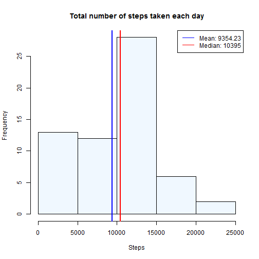
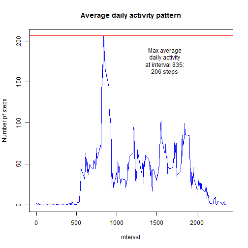
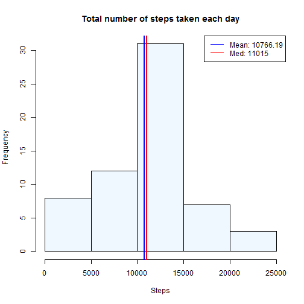
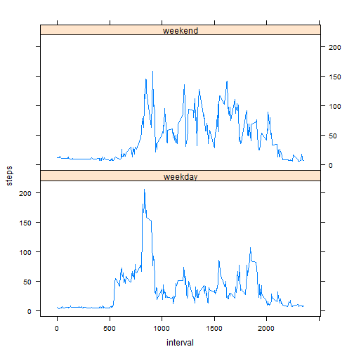

# Reproducible Research: Peer Assessment 1

## Loading and preprocessing the data


The first step is to unzip and load the file containing all activity data.


```r
data <- read.csv(unz("activity.zip", "activity.csv"))
```


The column "date" in the loaded data is then converted to the proper type (R Date).


```r
data$date <- data$date <- as.Date(as.character(data$date), "%Y-%m-%d")
```


## What is mean total number of steps taken per day?
First the sum of steps for each date in data is calculated, to simplyfy the next calculations of mean and median number of steps taken per day.


```r
totalStepsPerDay <- with(data,aggregate(steps, list(date),sum, na.rm=T))
meanNoOfStepsPerDay <- round(mean(totalStepsPerDay$x),2)
medianNoOfStepsPerDay <- median(totalStepsPerDay$x)
```


The calcultated values can then easily be highlighted in a histogram over steps taken per day.


```r
hist(totalStepsPerDay$x,col="aliceblue",main="Total number of steps taken each day",xlab="Steps")
abline(v = mean(totalStepsPerDay$x), col = "blue", lwd = 2)
abline(v = median(totalStepsPerDay$x), col = "red", lwd = 2)
legend("topright", legend = c(paste("Mean:",meanNoOfStepsPerDay),paste("Median:",medianNoOfStepsPerDay)),col=c("blue","red"), lwd=1)
```

 


## What is the average daily activity pattern?
Again, simplifying subsequent calculations by first calculating some helper data sets. This time the averge number of steps per 5-minute interval (each 5-minute interval is represented by an identifier in the "interval" column of data).


```r
avgNoOfStepsPerInterval <- with(data,aggregate(steps, list(interval),mean, na.rm=T, simplify = T))
names(avgNoOfStepsPerInterval) <- c("interval","avgSteps")
```


The variable "indexOfMax" is a helper value for easy access to the 5-minute interval where the average number of steps  taken is at it's peak.


```r
indexOfMax <- which.max(avgNoOfStepsPerInterval$avgSteps)
```


Plotting the daily activity pattern and identifying it's peak is made easier by using the helper data sets.


```r
plot(x=unique(data$interval),y=avgNoOfStepsPerInterval$avgSteps
     , type = "l", col = "blue"
     , main="Average daily activity pattern"
     , xlab="interval"
     , ylab="Number pf steps")
abline(h = avgNoOfStepsPerInterval[indexOfMax,2], col = "red", lwd = 1)
text(1600,avgNoOfStepsPerInterval[indexOfMax,2]-30,paste0("Max average\ndaily activity\nat interval ",avgNoOfStepsPerInterval[indexOfMax,1],":\n",round(avgNoOfStepsPerInterval[indexOfMax,2])," steps"))
```

 


## Imputing missing values
By summing up the number of missing values in each column of data, it's clear that only the column "steps" has missing values. Therefore, we only have to take that column into account when filling in the missing values in the next step.

```r
missingValuesPerColum <- colSums(is.na(data))
missingValuesPerColum
```

```
##    steps     date interval 
##     2304        0        0
```


First off, data is copied to a new data frame called data2.

```r
data2 <- data.frame(data)
```


The rows of data2 which contains missing values in the column "steps" are merged with the earlier created avgNoOfStepsPerInterval to facilitate easy lookup of average number of steps taken in that interval for the whole data set. The averages are stored into avgs.


```r
avgs <- merge(data2[is.na(data2[,1]),],avgNoOfStepsPerInterval,by.x="interval",by.y="interval",all=T)[,4]
```


The missing values can now be filled using the values of the average number of steps taken in each interval. A quick check using the same technique as before shows that there are no missing values in data2 anymore.


```r
data2[is.na(data2[,1]),1] <- avgs
missingValuesPerColum2 <- colSums(is.na(data2))
missingValuesPerColum2
```

```
##    steps     date interval 
##        0        0        0
```


Using the same type of helper variables and data set as before, mean and median number of steps for each day can now be calculated for the new data set without missing values.


```r
totalStepsPerDay2 <- with(data2,aggregate(steps, list(date),sum))
meanNoOfStepsPerDay2 <- round(mean(totalStepsPerDay2$x),2)
medianNoOfStepsPerDay2 <- median(totalStepsPerDay2$x)
```


Compared to the first plot where some values where missing, the mean and median is noticeably changed and probably reflects the actual values better.


```r
hist(totalStepsPerDay2$x,col="aliceblue",main="Total number of steps taken each day",xlab="Steps")
abline(v = mean(totalStepsPerDay2$x), col = "blue", lwd = 2)
abline(v = median(totalStepsPerDay2$x), col = "red", lwd = 2)
legend("topright", legend = c(paste("Mean:",meanNoOfStepsPerDay2),paste("Med:",medianNoOfStepsPerDay2)),col=c("blue","red"), lwd=1)
```

 


## Are there differences in activity patterns between weekdays and weekends?
To separate the rows originating from weekdays with the rows that originates from weekends, two columns are added to data2. isWeekend is a column containing TRUE or FALSE if the date of the row is a Weekend. 

In the POSIX standard, day 0 is Sunday and  day 6 is Saturday.

The helper column isWeekend is then used to create a new column, "isWeekendFactor", containing a factor valibale with the two levels "weekday" and "weekend".


```r
data2$isWeekend <- as.POSIXlt(data2$date, format="%Y-%m-%d")$wday %in% c(0, 6)
data2$isWeekendFactor <- as.factor(ifelse(data2$isWeekend,"weekend", "weekday"))
```


A new helper data set, "agg", is used to store the mean number of steps taken for each interval in weekdays and each interval in weekends from the data set.


```r
agg <- aggregate(steps ~ interval + isWeekendFactor, data = data2, mean)
```


Using the lattice plotting system, a comparison is made of the daily activity patterns of weekday days and weekend days in our newly calculated "agg" data set.


```r
library(lattice)
xyplot(steps ~ interval | isWeekendFactor, data = agg, layout = c(1,2), type="l")
```

 

